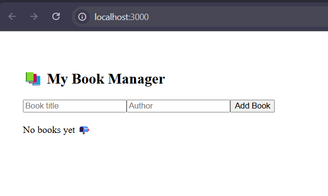
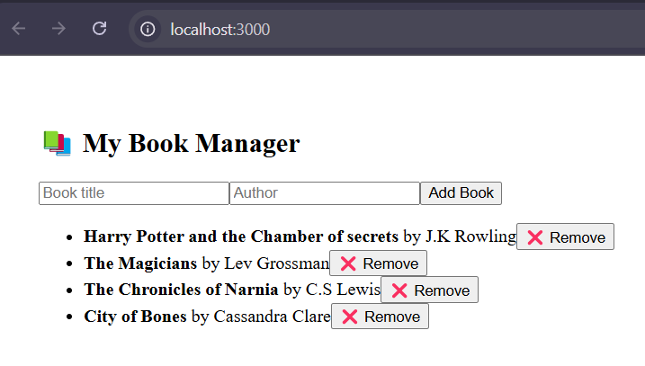
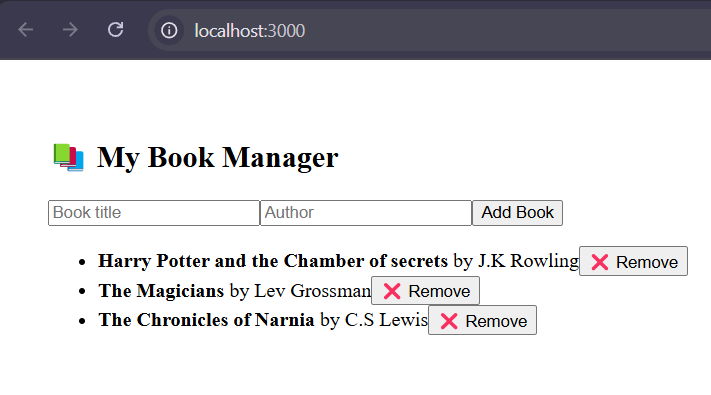

# 📚 Book Manager App (React + Redux Toolkit)

This is a simple Book Manager application built using **React**, **Redux Toolkit**, and **Functional Components with Hooks**. It allows users to add and remove books with global state management handled via Redux.

---

## 🛠️ Tech Stack

- **React** (Functional Components + Hooks)
- **Redux Toolkit** (`@reduxjs/toolkit`, `react-redux`)
- **useSelector** and **useDispatch** for interacting with the store

---

## 🚀 Features

- Add new books with title and author
- Remove books from the list
- Global state management using Redux Toolkit
- Component-based architecture

---

## 📂 Folder Structure

```plaintext
src/ ├── app/ │ └── store.js # Redux store setup ├── features/ │ └── books/ │ └── booksSlice.js # Redux slice for books ├── BookForm.js # Add book form ├── BookList.js # List of all books with remove functionality ├── App.js # Main component ├── index.js # Entry point with <Provider>
```

## 📸 Screenshots

### 🖥️ App Overview


### ➕ Adding a Book


### ❌ Removing a Book


